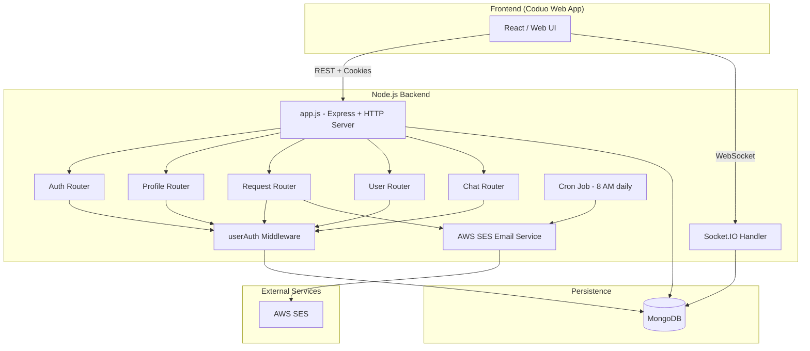
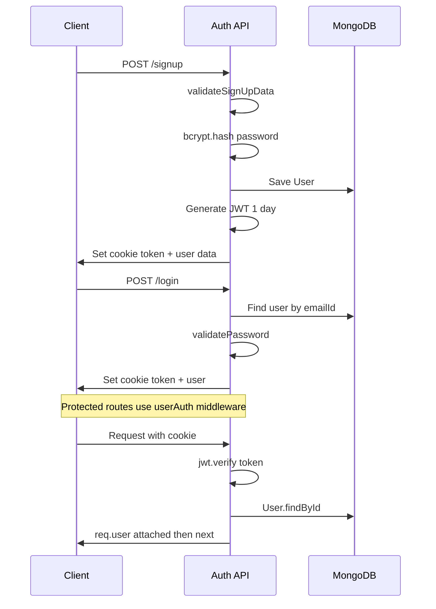
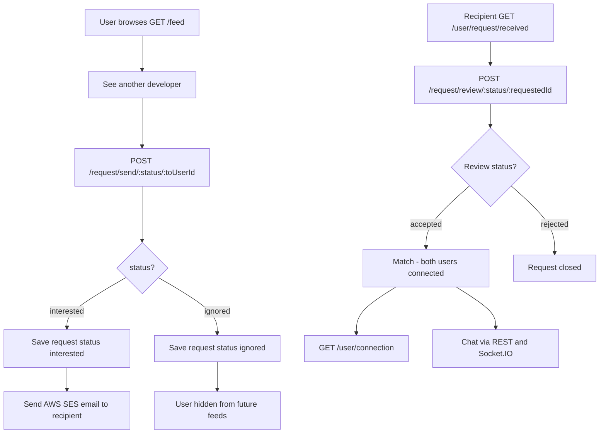
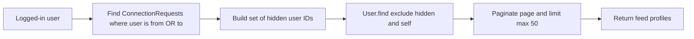
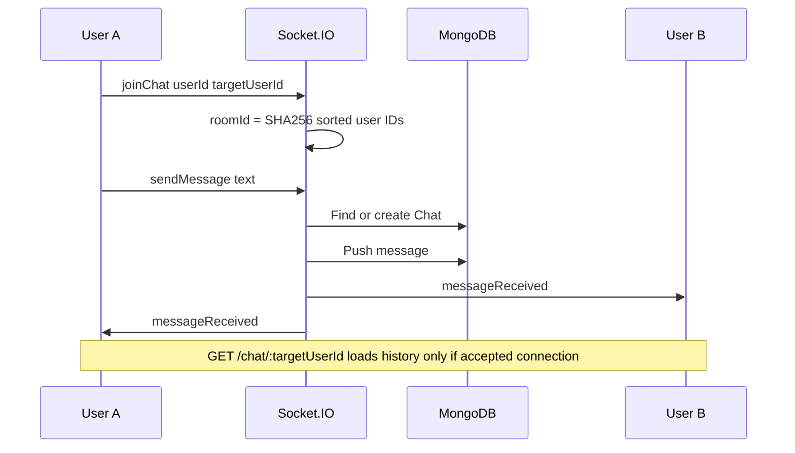
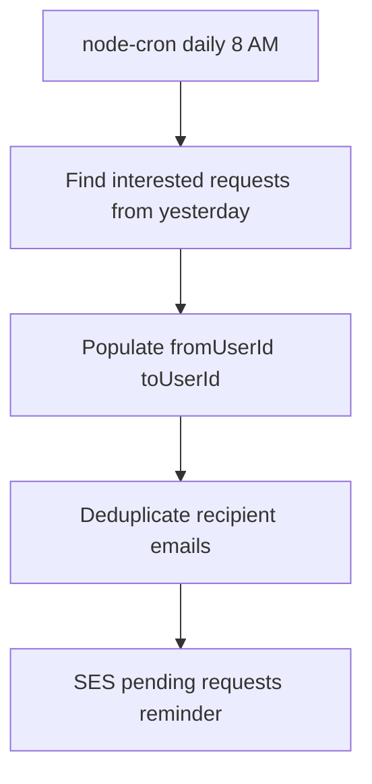

## Email Service

The project uses Amazon SES for email notifications.

**Note:** The AWS account is currently in the SES Sandbox. Therefore, emails can only be sent to verified email addresses and may only be received by the verified email account until production access is granted.

# Coduo — Developer Matching Backend

Backend API for **Coduo**, a developer networking platform where users discover peers, send connection requests , match on mutual interest, and chat in real time.

> **Tagline:** Swipe, match, build.

---

## Table of Contents

- [Overview](#overview)
- [Tech Stack](#tech-stack)
- [Architecture](#architecture)
- [Core Flows](#core-flows)
- [Project Structure](#project-structure)
- [Data Models](#data-models)
- [API Reference](#api-reference)
- [WebSocket Events](#websocket-events)
- [Environment Variables](#environment-variables)
- [Getting Started](#getting-started)
- [Scripts](#scripts)

---

## Overview

Coduo helps developers find collaborators. The backend handles:


| Area              | Description                                                      |
| ----------------- | ---------------------------------------------------------------- |
| **Auth**          | Sign up, login, logout with JWT stored in HTTP-only cookies      |
| **Profiles**      | View and edit user profiles; forgot/reset password flow          |
| **Discovery**     | Paginated feed of users not yet connected or requested           |
| **Connections**   | Send `interested` / `ignored`, review as `accepted` / `rejected` |
| **Chat**          | REST history + Socket.IO real-time messaging (connections only)  |
| **Notifications** | AWS SES emails on new requests; daily cron for pending requests  |


---

## Tech Stack


| Layer      | Technology                       |
| ---------- | -------------------------------- |
| Runtime    | Node.js (CommonJS)               |
| Framework  | Express 5                        |
| Database   | MongoDB + Mongoose               |
| Auth       | JWT + `bcrypt` + `cookie-parser` |
| Real-time  | Socket.IO                        |
| Email      | AWS SES (`@aws-sdk/client-ses`)  |
| Scheduling | `node-cron` + `date-fns`         |
| Validation | `validator`                      |


---

## Architecture

High-level system design:




ASCII overview (works everywhere):

```
┌─────────────┐     REST + cookies      ┌──────────────────────────────────┐
│   Frontend  │ ───────────────────────►│  Express (auth, profile, request, │
│  (Coduo UI) │     WebSocket           │  user, chat routers) + Socket.IO │
└─────────────┘ ───────────────────────►└──────────────┬───────────────────┘
                                                     │
                     ┌───────────────────────────────┼───────────────────────┐
                     ▼                               ▼                       ▼
              ┌─────────────┐                 ┌─────────────┐          ┌──────────┐
              │   MongoDB   │                 │  node-cron  │          │ AWS SES  │
              │ Users,      │                 │ Daily 8 AM  │          │ Emails   │
              │ Requests,   │                 │ reminders   │          │          │
              │ Chats       │                 └─────────────┘          └──────────┘
              └─────────────┘
```

---

## Core Flows

### 1. Authentication Flow




### 2. Connection Request Flow (Swipe to Match)




**Connection request statuses**


| Status       | Set by    | Meaning                 |
| ------------ | --------- | ----------------------- |
| `interested` | Sender    | Wants to connect        |
| `ignored`    | Sender    | Passed / not interested |
| `accepted`   | Recipient | Mutual match            |
| `rejected`   | Recipient | Declined request        |


### 3. Feed Algorithm




Users already involved in any request (either direction) are excluded from the discovery feed.

### 4. Real-Time Chat Flow




Room IDs are deterministic hashes of both participant IDs, so both clients join the same room.

### 5. Scheduled Email Reminders




---

## Project Structure

```
coduo-dev-matching/
├── app.js                      # Entry: Express, CORS, routes, HTTP + Socket.IO
├── package.json
├── .env                        # Environment variables (not committed)
└── src/
    ├── config/
    │   └── database.js         # MongoDB connection
    ├── middlewares/
    │   └── auth.js             # userAuth, userPasswordAuth
    ├── models/
    │   ├── user.js
    │   ├── connectionRequest.js
    │   └── chat.js
    ├── router/
    │   ├── auth.js             # signup, login, logout
    │   ├── profile.js          # view, edit, forgot/reset password
    │   ├── request.js          # send and review requests
    │   ├── user.js             # received requests, connections, feed
    │   └── chat.js             # chat history REST
    └── utils-helper/
        ├── validation.js
        ├── socket.js           # Socket.IO events
        ├── cronJob.js          # Daily pending-request emails
        ├── sendEmail.js
        └── sesClient.js
```

---

## Data Models

### User


| Field                                          | Type    | Notes                   |
| ---------------------------------------------- | ------- | ----------------------- |
| `firstName`, `lastName`                        | String  | Required on signup      |
| `emailId`                                      | String  | Unique, validated email |
| `password`                                     | String  | Hashed with bcrypt      |
| `age`, `gender`, `about`, `skills`, `photoUrl` | Various | Profile fields          |


### ConnectionRequest


| Field        | Type     | Notes                                   |
| ------------ | -------- | --------------------------------------- |
| `fromUserId` | ObjectId | Sender                                  |
| `toUserId`   | ObjectId | Recipient                               |
| `status`     | Enum     | interested, ignored, accepted, rejected |


Compound index on `(fromUserId, toUserId)`. Cannot send a request to yourself.

### Chat


| Field          | Type       | Notes                      |
| -------------- | ---------- | -------------------------- |
| `participants` | ObjectId[] | Two user IDs               |
| `messages[]`   | Subdocs    | senderId, text, timestamps |


---

## API Reference

Protected routes require the `token` cookie from login or signup.

### Authentication


| Method | Endpoint  | Auth | Description           |
| ------ | --------- | ---- | --------------------- |
| POST   | `/signup` | No   | Register; sets cookie |
| POST   | `/login`  | No   | Login; sets cookie    |
| POST   | `/logout` | Yes  | Clears cookie         |


### Profile


| Method | Endpoint                   | Auth        | Description               |
| ------ | -------------------------- | ----------- | ------------------------- |
| GET    | `/profile/view`            | Yes         | Current user profile      |
| PATCH  | `/profile/edit`            | Yes         | Update profile fields     |
| POST   | `/profile/forgot-password` | No          | Reset token cookie 20 min |
| PATCH  | `/profile/reset-password`  | Reset token | Set new password          |


### Connection Requests


| Method | Endpoint                               | Auth | Description                   |
| ------ | -------------------------------------- | ---- | ----------------------------- |
| POST   | `/request/send/:status/:toUserId`      | Yes  | status: interested or ignored |
| POST   | `/request/review/:status/:requestedId` | Yes  | status: accepted or rejected  |


### User and Feed


| Method | Endpoint                 | Auth | Description                 |
| ------ | ------------------------ | ---- | --------------------------- |
| GET    | `/user/request/received` | Yes  | Pending interested requests |
| GET    | `/user/connection`       | Yes  | Accepted connections        |
| GET    | `/feed?page=1&limit=10`  | Yes  | Discovery feed              |


### Chat


| Method | Endpoint              | Auth | Description                                |
| ------ | --------------------- | ---- | ------------------------------------------ |
| GET    | `/chat/:targetUserId` | Yes  | Chat history; creates empty chat if needed |


---

## WebSocket Events

Connect to the same host and port as the HTTP server. CORS origin must match `FRONTEND_URL`.

**Client to server**


| Event       | Payload                                         | Description        |
| ----------- | ----------------------------------------------- | ------------------ |
| joinChat    | firstName, userId, targetUserId                 | Join room          |
| sendMessage | firstName, lastName, userId, targetUserId, text | Save and broadcast |


**Server to client**


| Event           | Payload                                        |
| --------------- | ---------------------------------------------- |
| messageReceived | firstName, lastName, text, timestamp, senderId |


---

## Environment Variables

Create a `.env` file in the project root:

```env
PORT=7777
FRONTEND_URL=http://localhost:5173
DATABASE_CONNECTION_STRING=mongodb://127.0.0.1:27017/coduo
JWT_SECRET_KEY=your_jwt_secret
JWT_SECRET_KEY_FOR_RESET_PASSWORD=your_reset_password_secret
AWS_SES_ACCESS_KEY=your_access_key
AWS_SES_SECRET_KEY=your_secret_key
```


| Variable                                | Purpose                 |
| --------------------------------------- | ----------------------- |
| PORT                                    | HTTP and Socket.IO port |
| FRONTEND_URL                            | CORS origin             |
| DATABASE_CONNECTION_STRING              | MongoDB URI             |
| JWT_SECRET_KEY                          | Auth token 1 day        |
| JWT_SECRET_KEY_FOR_RESET_PASSWORD       | Reset token 20 min      |
| AWS_SES_ACCESS_KEY / AWS_SES_SECRET_KEY | Email delivery          |


---

## Getting Started

### Prerequisites

- Node.js 18+
- MongoDB (local or Atlas)
- AWS SES credentials (for emails)

### Installation

```bash
git clone <repository-url>
cd coduo-dev-matching
npm install
```

Create `.env` using the template above, then:

```bash
npm start
```

Expected output:

```
DataBase connection Established
Server is succesfully listening on port 7777
```

### Development

```bash
npm run dev
```

### Frontend notes

- Use `credentials: 'include'` so auth cookies are sent.
- Socket.IO client should match CORS and pass user IDs in events.

> **Preview tip:** Mermaid diagrams render on GitHub. In VS Code/Cursor, open Markdown preview (`Cmd+Shift+V` on Mac) or install a Mermaid extension if diagrams look blank.

---

## Scripts


| Command     | Description        |
| ----------- | ------------------ |
| npm start   | Production server  |
| npm run dev | Nodemon hot reload |


---

## Author

**Aman Raj**

## License

ISC
